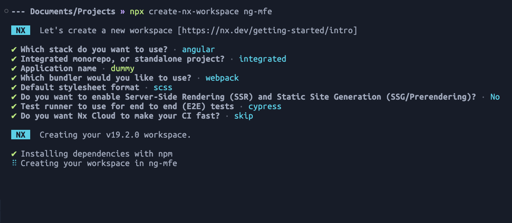
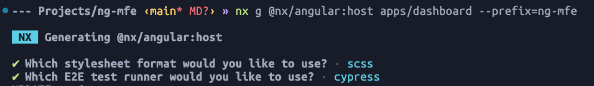
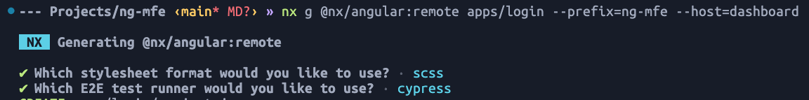
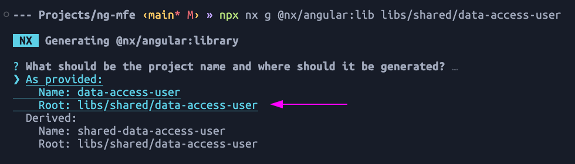

# Advanced Angular Micro Frontends with Dynamic Module Federation and Setup incremental builds

✨ **This workspace has been generated by [Nx, Smart Monorepos · Fast CI.](https://nx.dev/recipes/angular/dynamic-module-federation-with-angular)** ✨

## Create an `Nx` Workspace:

```sh
npx create-nx-workspace ng-mfe
```

You'll be prompted a few questions. Pick the `Angular` stack, `Integrated` Monorepo layout and the `webpack` bundler. You can refer the follwoing image.



> $\textcolor{#ff5861}{\textsf{NOTE:}}$ As you can not skip `Application name`, use a random application name like `dummy`. Once the NX workspace is successfully created, delete the `dummy` application from the `apps/` directory.

## Creating applications:

- ### Creating `host/shell` application:

  - Generate two applications that support _Module Federation_. Start with the _Dashboard_ application which will act as a **host** application for the Micro-Frontends (MFEs):

    ```sh
    npx nx g @nx/angular:host apps/dashboard --prefix=ng-mfe
    ```

  - You'll be prompted a few questions. Pick the `scss` stylesheet format, and `cypress` E2E runner. You can refer the follwoing image.



- If you encounter the error message $\textcolor{#ff5861}{\textsf{"NX Failed to process project graph. Run 'nx reset' to fix this. Please report the issue if you keep seeing it."}}$, follow these steps to resolve it:

  ```shell
  1. remove `node_modules`
  2. npm cache clean --force
  3. npm cache verify
  4. npm install
  ```

- ### Creating `remote` application:

  - Generate the _Login_ application as a **remote** application that will be consumed by the **Dashboard host** application.

    ```sh
    npx nx g @nx/angular:remote apps/login --prefix=ng-mfe --host=dashboard
    ```

  - You'll be prompted a few questions. Pick the `scss` stylesheet format, and `cypress` E2E runner. You can refer the follwoing image.



- ### Creating a buildable `library`:

  - Generate a buildable **library** that will be shared between the `host` application and the `remote` application.

    ```sh
    npx nx g @nx/angular:lib --directory=libs/shared/data-access-user --buildable
    ```

  - You'll be prompted a few questions. Pick the `As provided`. You can refer the follwoing image.

    

        > This will scaffold a new library for us to use.

- ### Creating a `service`:

  - Generate an `Angular Service` that will hold the **state**:

    ```sh
      npx nx g @nx/angular:service user --project=data-access-user
    ```

## Converting the Dashboard application to <ins>Dynamic Module Federation</ins>:

- Add a `module-federation.manifest.json` file to the `src/assets/` folder in `Dashboard` application with the following content:

  ```json
  {
    "login": "http://localhost:4201"
  }
  ```

- Next, open the `main.ts` file under `src/` folder in `Dashboard` application and replace it with the following:

  ```ts
  import { setRemoteDefinitions } from '@nx/angular/mf';

  fetch('/assets/module-federation.manifest.json')
    .then((res) => res.json())
    .then((definitions) => setRemoteDefinitions(definitions))
    .then(() => import('./bootstrap').catch((err) => console.error(err)));
  ```

- ### Change how Remotes are loaded:

  - Open the `module-federation.config.ts` file at the root of our `apps/dashboard/` folder and set the remotes property to be an <ins>empty array</ins>.
  - Next, we need to change how our application attempts to load the Remote when it is routed to. Open the `app.routes.ts` file under the `src/app/` folder in `Dashboard` application and apply the following changes:

    ```ts
    import { Route } from '@angular/router';
    import { loadRemoteModule } from '@nx/angular/mf';    <-- Updated
    import { AppComponent } from './app.component';
    export const appRoutes: Route[] = [
      {
        path: 'login',
        loadChildren: () => loadRemoteModule('login', './Routes').then((m) => m.remoteRoutes),    <-- Updated
      },
      {
        path: '',
        component: AppComponent,
      },
    ];
    ```

  - > $\textcolor{#ca8a04}{\textsf{NOTE:}}$ Open the `project.json` file under the `src/` folder in `Dashboard` application and add the newly created `assests` folder as follows:
    ```json
    "assets": [
      {
        "glob": "**/*",
        "input": "apps/dashboard/public"
      },
      "apps/dashboard/src/assets"   <-- Updated
    ],
    ```
  - That’s all the changes required. Then, Serve both `Dashboard` and `Login` apps.
    ```sh
    npx nx serve dashboard --devRemotes=login
    ```

## Creating a new Dynamic Host application:

- Generate the `Employee` **Host** application

  ```sh
  npx nx g @nx/angular:host apps/employee --remotes=login --dynamic
  ```

  > $\textcolor{#ff5861}{\textsf{NOTE:}}$ By default, the `module-federation.manifest.json` file is generated in the `public/` folder of the `employee` application. You should move this file to the `src/assets/` directory (create the `assets` directory if it does not exist). After moving the file, update its path in the `main.ts` file located in the `src/` directory. Additionally, add the line `"apps/employee/src/assets"` to the `assets` section of the `build` targets in the `project.json` file within the `employee` application.

  > $\textcolor{#0ea5e9}{\textsf{INFO:}}$ You should take a look at the files generated and see how the`Login` Remote application was added to the `module-federation.manifest.json` file and the slight changes to `main.ts` and `app.routes.ts` to load the Remotes dynamically.

- Generate the `Todo` **Remote** application
  ```sh
  npx nx g @nx/angular:remote apps/todo --host=employee
  ```

## Serving applications:

- ### Serve `Login` app:
  - Navigate to `root` directory and execute the following command.
    ```sh
    npx nx run login:serve
    ```
    - Navigate to `http://localhost:4201` that we see the login form rendered.
    - If we type in the correct username and password (**demo**, **demo**), then we can also see the user gets authenticated!
    - Perfect! Our `Login` application is complete.
- ### Serve both `Dashboard` and `Login` apps:
  - Navigate to `root` directory and execute the following command.
    ```sh
    npx nx serve dashboard --devRemotes=login
    ```
    - Navigate to `http://localhost:4200` that we see the Dashboard application with the Login application embedded within it.
    - If you log in, you should see the content change to show that you are authenticated.

> $\textcolor{#16a34a}{\textsf{This concludes the setup required for a Micro Frontend approach using Static Module Federation.}}$

> $\textcolor{#ca8a04}{\textsf{When serving module federation apps locally in dev mode, there'll be an error output to the console(inspect devTools): import.meta cannot be used outside of a module.}}$
> $\textcolor{#ca8a04}{\textsf{You'll see the error originates from the styles.js script. It's a known error output, and as far as our testing has shown, it doesn't cause any breakages.}}$
> $\textcolor{#ca8a04}{\textsf{It happens because the Angular compiler attaches the styles.js file to the index.html in a 'script' tag with defer.}}$
>
> $\textcolor{#ca8a04}{\textsf{It needs to be attached with type=module, but Angular can't make that change because it breaks HMR. They also provide no way of hooking into that process for us to patch it ourselves.}}$
>
> $\textcolor{#ca8a04}{\textsf{The good news is that the error doesn't propagate to production because styles are compiled to a CSS file, so there's no erroneous JS to log an error.}}$
>
> $\textcolor{#ca8a04}{\textsf{It's worth stressing that no errors or breakages have been noted from our tests.
}}$

# Or simply run the applications:
  ```sh
  npm run run-many
  ```

  ```sh
  npm run start:emp
  ```

  ```sh
  npm run start:dash
  ```
